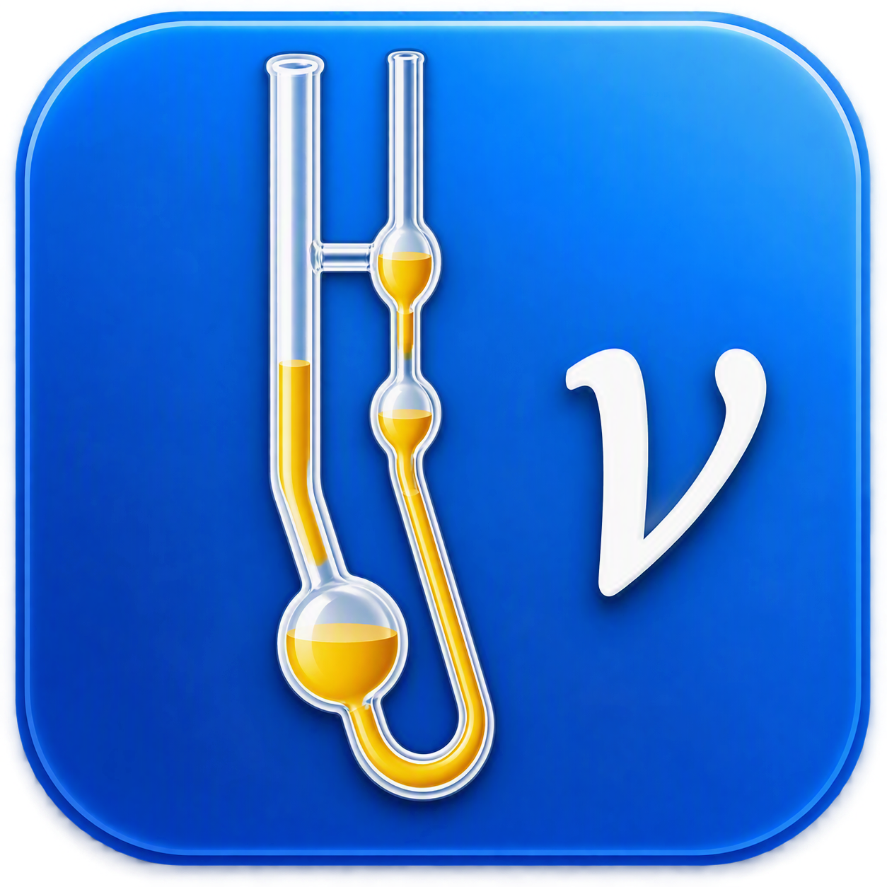

```{r, include = FALSE}
knitr::opts_chunk$set(
  collapse = TRUE,
  comment = "#>",
  fig.path = "man/figures/README-"
)

# Point the package at a throwaway SQLite registry so running this README
# never touches (or creates) the real user-level reference.db. Not shown
# in the rendered output.
.readme_db <- tempfile(fileext = ".db")
options(kinvicalc.reference_db_path = .readme_db)
```

# kinvicalc 

<!-- badges: start -->
[](https://github.com/pbulsink/kinvicalc/actions/workflows/R-CMD-check.yaml)
[](https://coveralls.io/github/pbulsink/kinvicalc?branch=main)
<!-- badges: end -->

`kinvicalc` is an R package implementing ASTM D445-26 / D446-24 kinematic
viscosity workflows for viscometer-based testing. It provides a reusable API
for:

- validating viscometer and sample-type records
- resolving calibration factors, interpolated between 40 C and 100 C
- calculating kinematic viscosity (`nu = C * t`) from measured flow times
- flagging (not correcting) flow times below the ASTM minimum
- evaluating determinability, repeatability, and reproducibility per D445-26
  Section 17, including a "standard" reference-sample QA/QC check against a
  known expected value
- storing viscometer and sample-type metadata in a local SQLite registry,
  with in-place calibration-factor correction for existing viscometers
- generating print-friendly primary and high-density sample reports, plus a
  session results table

`kinvicalc` does **not** implement a kinetic energy (E) correction or a
gravity correction; low flow times are surfaced to the operator via a flag
instead of being silently corrected.

## Installation

```r
# install.packages("pak")
pak::pak("pbulsink/kinvicalc")
```

## Example

The example below registers a viscometer, then calculates and evaluates a
two-determination result. The flow times are chosen so the two determinations
agree closely and the determinability check passes; see
`evaluate_determinability()` for what happens (and how it is reported) when
it does not.

```{r example}
library(kinvicalc)

viscometer <- tibble::tibble(
  viscometer_id = "001-00001",
  viscometer_size = 1,
  serial_number = "00001",
  calibration_date = as.Date("2024-01-01"),
  status = "active",
  factor_40_top = 0.025,
  factor_40_bottom = 0.029,
  factor_100_top = 0.016,
  factor_100_bottom = 0.018
)

add_viscometer(viscometer)

result <- build_sample_result(
  viscometer_id = "001-00001",
  sample_type = "unlisted",
  analysis_temperature_c = 40,
  time_1 = 232,
  time_2 = 200
)

result$kinematic_viscosity_cSt
```

A print-friendly HTML report can be written from the same result object with
`render_primary_report(result, output_path = "report.html")`; for a quick
look at the console, inspect the result fields directly:

```{r report}
result[c(
  "viscometer_id",
  "sample_type",
  "kinematic_viscosity_cSt",
  "determinability_result",
  "low_flow_time_flag"
)]
```

## Shiny app

`kinvicalc` ships an interactive Shiny app for day-to-day lab use: entering
two flow-time determinations, viewing the calculated result and
determinability/repeatability/reproducibility checks (including the
"standard" QA/QC reference-sample workflow), locking results into a session
table, and adding or correcting viscometers in the registry.

Launch it with:

```r
library(kinvicalc)
run_app()
```

Do not `source()` or run `R/app.R` directly from a package checkout — always
launch via `run_app()` (or, for local development, the thin delegator at
`inst/shiny/app.R`), so that package-internal helpers resolve correctly.

```{r, include = FALSE}
unlink(.readme_db)
```
