```{r, setup, include = FALSE}
knitr::opts_chunk$set(
  collapse = TRUE,
  comment = "#>"
)
```

## Who this vignette is for

`kinvicalc` ships with a Shiny app (`run_app()`) that lets a lab operator
record kinematic viscosity measurements, check them against ASTM D445-26
precision limits, and maintain a registry of viscometers, all without
writing any R code. This vignette walks through the app screen by screen,
following one sample from an empty registry through to a locked, reportable
result. It complements the
[`updating_precision_values`](updating_precision_values.html) vignette,
which covers changing the ASTM limits the app checks against, and the
[`kinvicalc-workflows`](kinvicalc-workflows.html) vignette, which shows the
same workflow driven from R directly.

Launch the app from an R console with:

```{r, eval = FALSE}
library(kinvicalc)
run_app()
```

This opens in your default web browser (or the Viewer pane in RStudio/
Positron). The app has three tabs: **Calculation**, **Reporting**, and
**Viscometers**. The tour below visits them in the order a new lab would
typically use them: register a viscometer first, then run and lock a
sample result, then review the locked results table.

## Step 1: Register a viscometer

Before any sample can be measured, the viscometer used for the test must be
in the local registry. Open the **Viscometers** tab. On a fresh
installation, the maintenance form and the results table below it are both
empty:

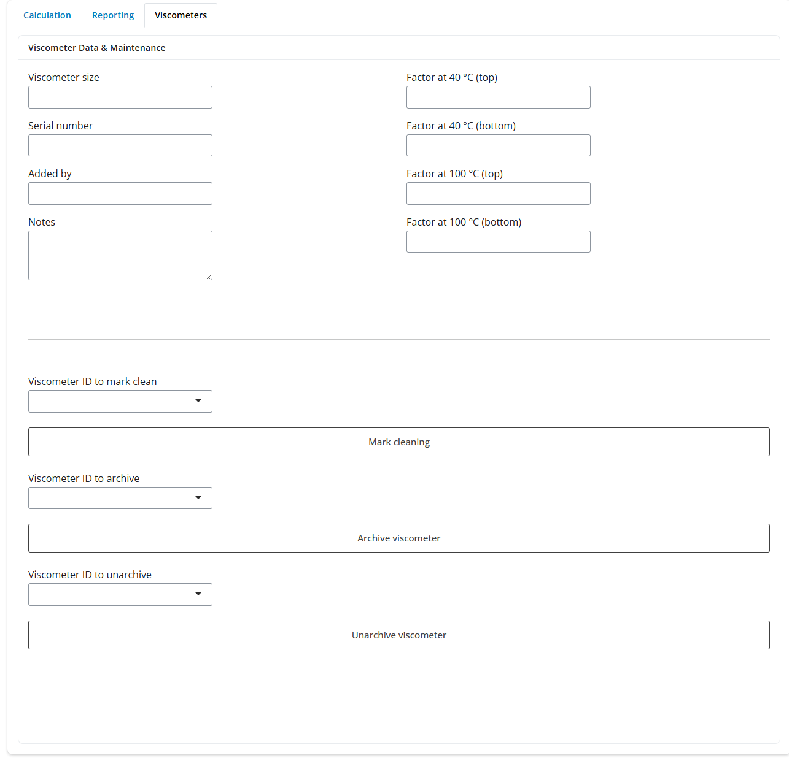

Fill in the viscometer's size, serial number, and its four calibration
factors (top and bottom bulb, at 40 C and 100 C, taken from the
viscometer's certificate). As you type the size and serial number, the app
previews the canonical `NNN-NNNNN` viscometer ID it will use as the primary
key:

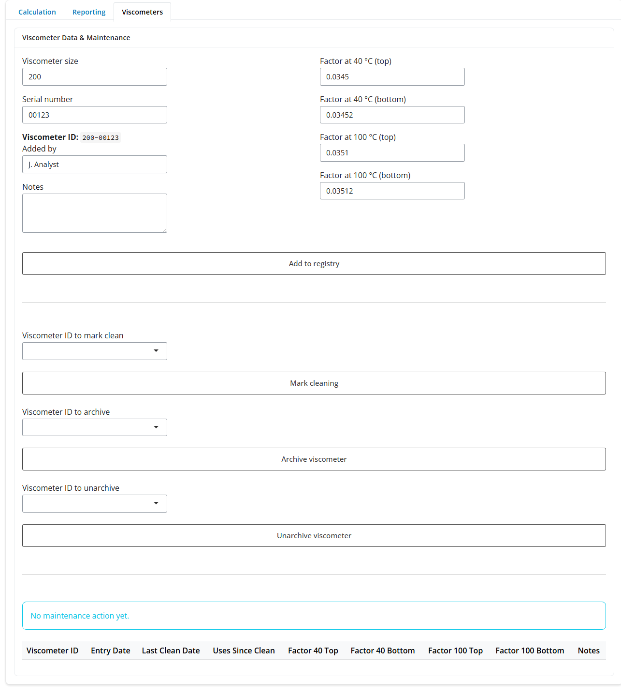

Clicking **Add to registry** stores the viscometer and immediately reflects
it in the table at the bottom of the tab, along with an entry timestamp and
a use counter that starts at zero:

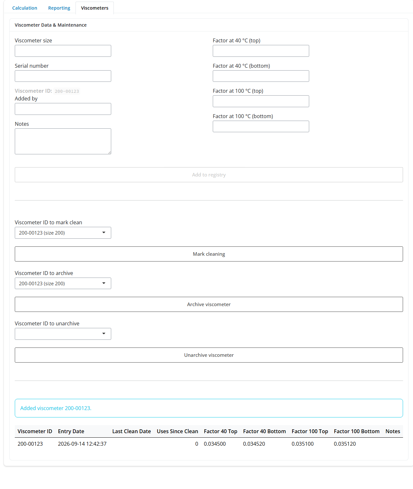

If you instead enter a size/serial combination that already exists, this
same button relabels itself **Update Viscometer Factors** and pops a
confirmation dialog before correcting the stored factors -- this is the
supported way to fix a data-entry error in a calibration factor without
losing the viscometer's creation date or use history. The lower half of
this tab also has controls for marking a viscometer cleaned (resetting its
use-since-cleaning counter), archiving a retired viscometer, and
unarchiving one if needed.

## Step 2: Enter a sample and check the result

Switch to the **Calculation** tab. Before anything is entered, the form
shows a placeholder result and a reminder of which fields are still needed:

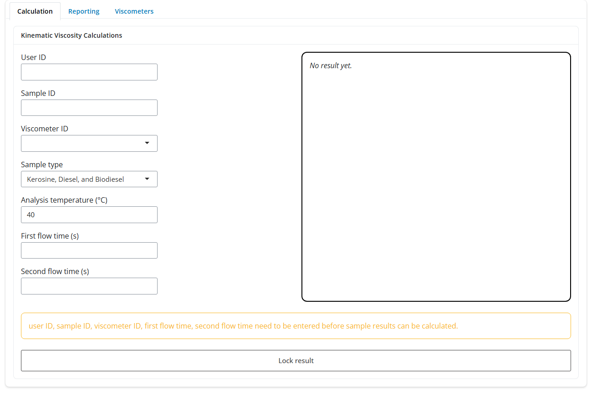

Fill in the operator's user ID, a sample ID, the viscometer to use (chosen
from the registry populated in Step 1), the sample type, the analysis
temperature, and the two measured flow times. The result panel on the right
updates live as you type -- there is no separate "Calculate" button. Here,
both flow times are close enough together that the determinability check
(ASTM D445-26 11.2.3/12.4.1, comparing the two individually calculated
viscosities) passes:

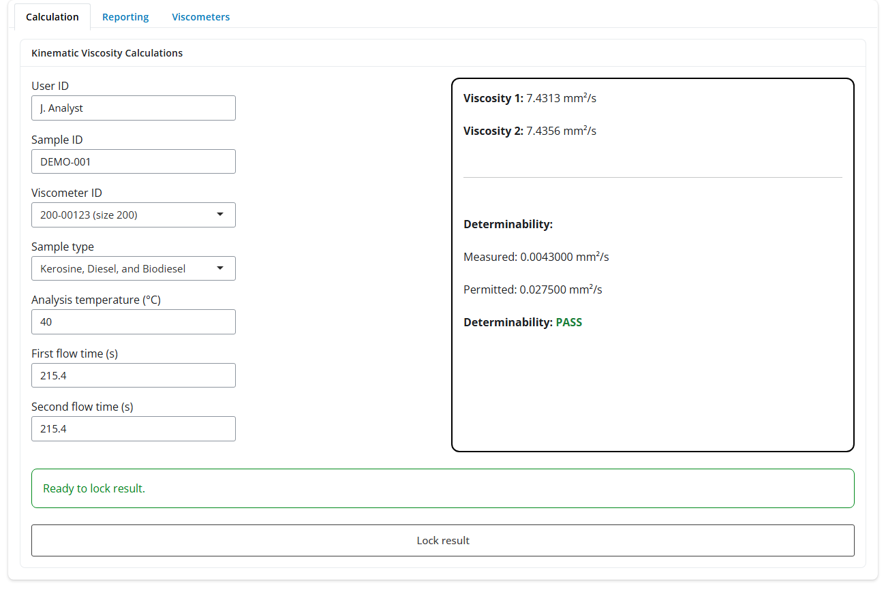

Had the two flow times disagreed by more than the sample type's
determinability limit, this panel would instead show **FAIL** in red and
the message strip below the result panel would recommend cleaning and
redrying the viscometer before repeating the measurement, per ASTM D445-26
11.2.3/12.4.1 -- the app surfaces this as a warning rather than blocking the
result outright, since the operator may still need to record and
investigate a failing pair.

### Standard reference-sample QA/QC

Selecting sample type **Standard Reference Material** reveals an additional
required field, **Expected Value**, and unlocks two more checks once it is
filled in: a repeatability (r) and reproducibility (R) comparison of the
measured result against that known expected value, per the lab's
Characterization Laboratory QA/QC procedure. Unlike the ordinary
repeatability/reproducibility checks (which compare two independent
measured results and center the limit on their average), this standard
check centers the limit on the expected value itself:

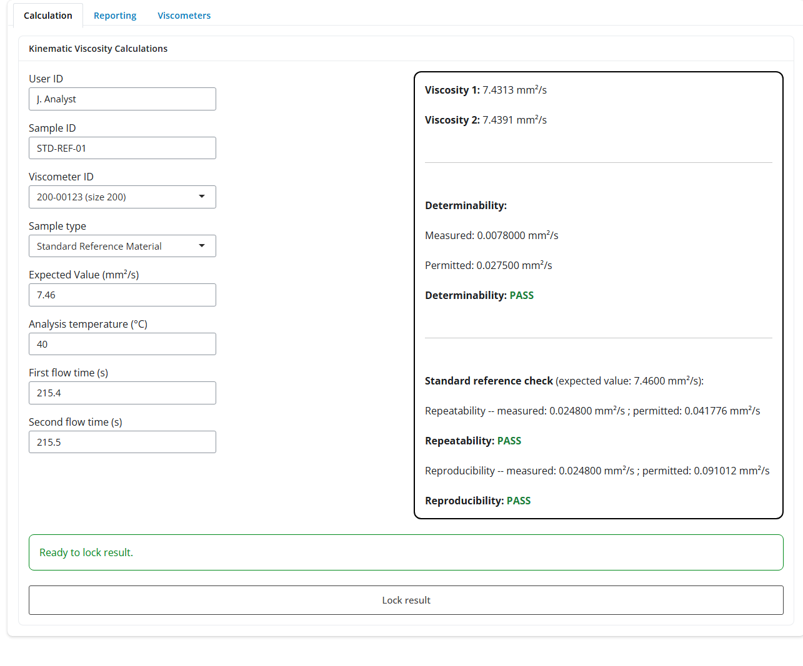

## Step 3: Lock the result

Once you are satisfied with the calculated result, click **Lock result**.
Locking clears the sample ID and flow-time fields (ready for the next
sample on the same viscometer) and confirms the sample name that was just
locked:

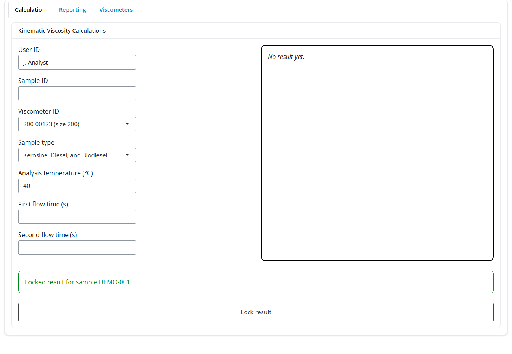

Locking also increments the viscometer's use counter in the registry, so
the **Viscometers** tab's "Uses Since Clean" column stays current without a
separate manual step.

## Step 4: Review locked results

The **Reporting** tab accumulates every result locked during the current
app session into a single table, formatted for a QA record: sample
identity, viscometer, both individual flow times and viscosities, the
averaged result, a colour-coded QA/QC column, and the operator and
timestamp:

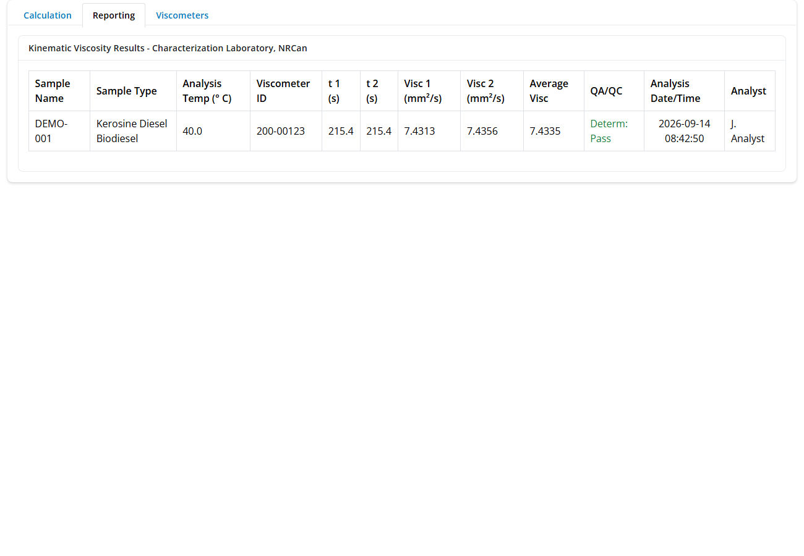

For a standard reference sample, the QA/QC column shows three lines
(determinability, r, and R) instead of the single determinability line
shown for other sample types, so a reviewer can see all three checks at a
glance without opening each row's original calculation.

## Summary

The app tour follows one path through `kinvicalc`'s three tabs: register a
viscometer (**Viscometers**), enter and lock a sample result while
reviewing its precision checks (**Calculation**), and review the
accumulated, reportable results for the session (**Reporting**). The
underlying calculations, precision rules, and registry are exactly the
functions documented in the package's other vignettes and help pages --
the app is a convenience layer over `build_sample_result()`,
`add_viscometer()`, `update_viscometer_factors()`, and the rest of the
exported API, for operators who prefer a form-based workflow to writing R
code directly.

## Appendix: viscometer maintenance actions

Section [Step 1](#step-1-register-a-viscometer) above covers adding a
brand-new viscometer. The same **Viscometers** tab also supports three
ongoing maintenance actions on a viscometer already in the registry:
correcting its calibration factors, marking it as cleaned, and taking it in
and out of service via archiving. This appendix walks through each.

### Correcting calibration factors

If a calibration factor was mistyped, or the viscometer has been
re-certified with new factors, re-enter that viscometer's size and serial
number in the same form used to add it. As soon as the size/serial
combination matches an existing registry entry, the action button
relabels itself **Update Viscometer Factors** in place of **Add to
registry**:


Clicking it pops a confirmation dialog before anything is written, since
this action overwrites the stored factors:

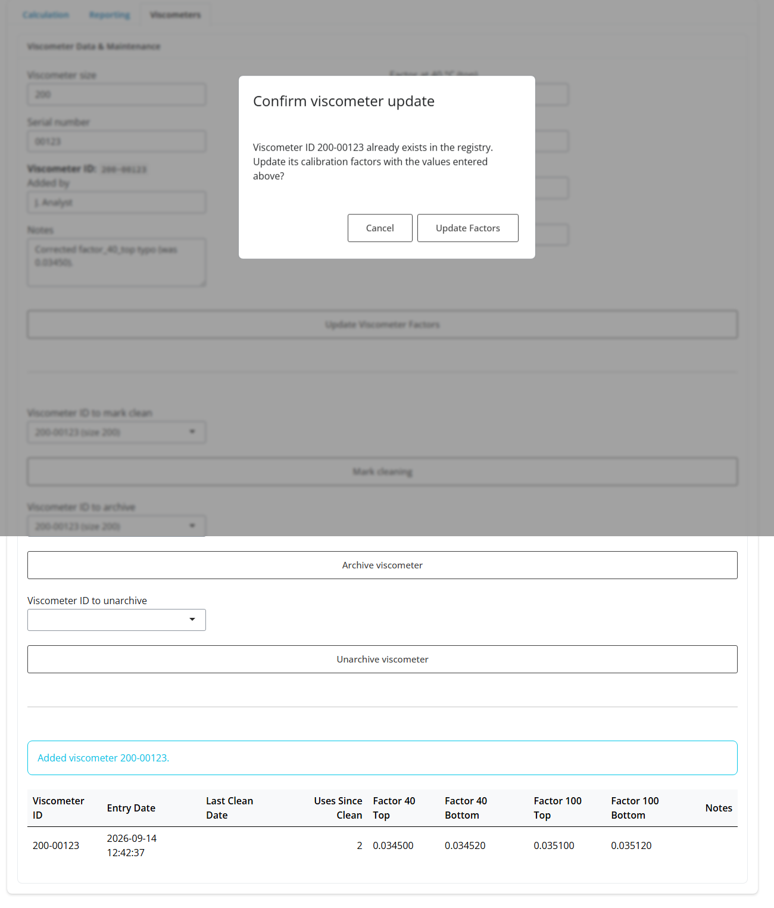

Confirming applies the new factors and records the note. Only the four
calibration factors and the notes field are changed -- the registry
preserves the original entry date and use counters, so the viscometer's
history stays intact:

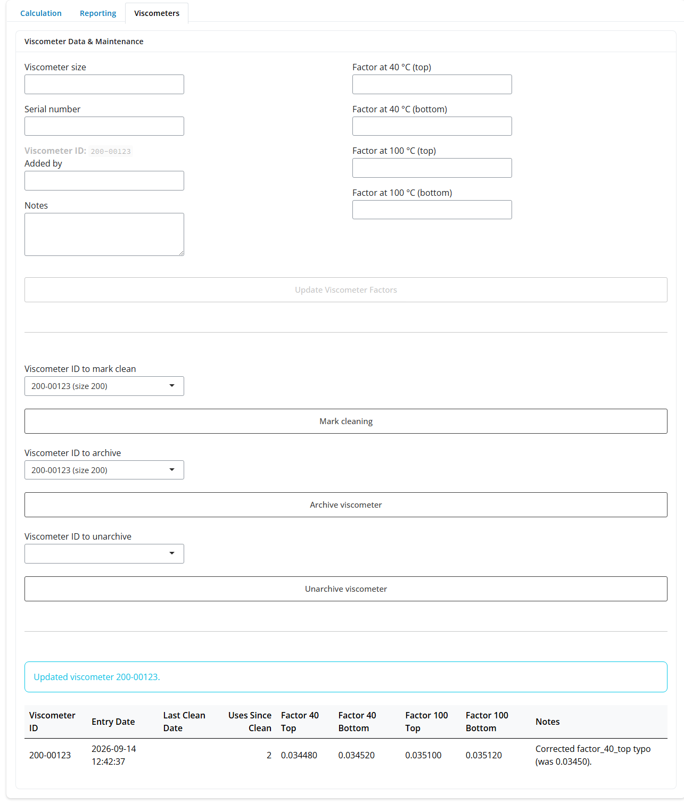

If you leave **Notes** blank when correcting factors, `kinvicalc` writes an
auto-generated `"Updated <date> by <updated_by>"` note instead, so a
correction is never left untraceable.

### Marking a viscometer cleaned

ASTM D445-26 calls for periodic deep cleaning of a viscometer, and the
"Uses Since Clean" count in the registry table tracks how many
measurements have accumulated since the last clean. Select the viscometer
from the **Viscometer ID to mark clean** dropdown and click **Mark
cleaning** to reset that counter and stamp a new "Last Clean Date":

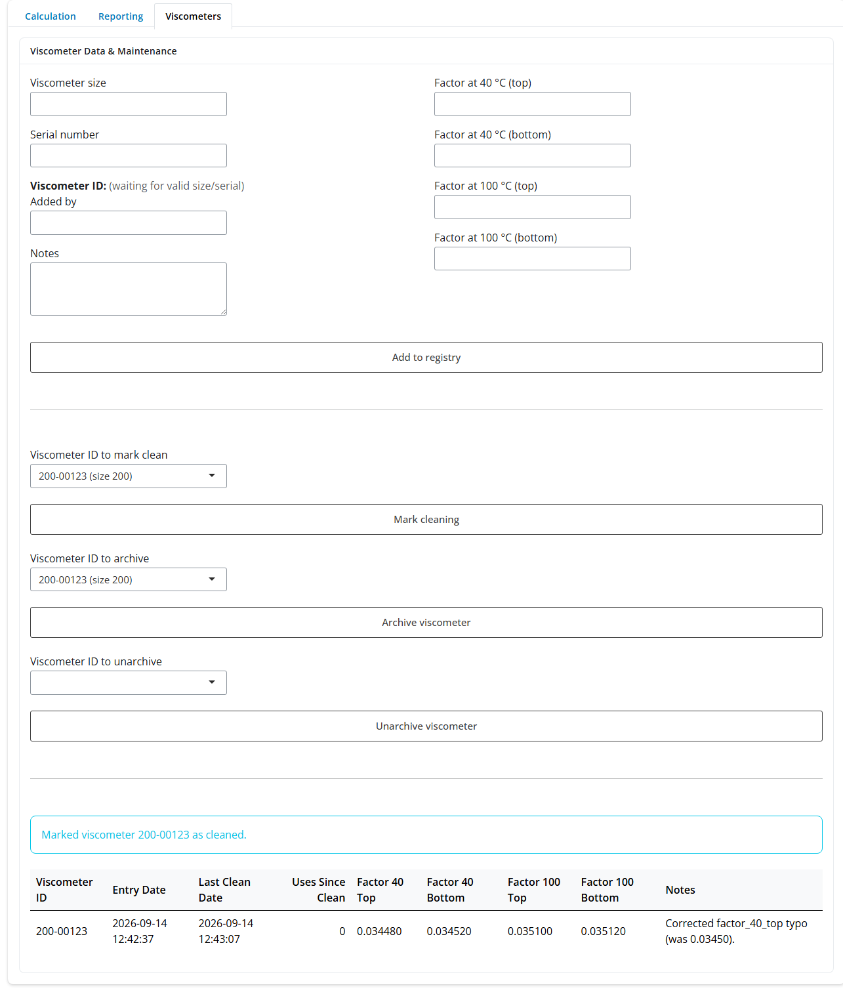

### Archiving and unarchiving a viscometer

When a viscometer is retired or taken out of service (for example, damaged
or sent out for re-certification), archive it using the **Viscometer ID to
archive** dropdown and **Archive viscometer** button. Archiving does not
delete the viscometer or its history -- it only removes it from the active
selection lists used elsewhere in the app (such as the Calculation tab's
viscometer dropdown), and it becomes available in the **Viscometer ID to
unarchive** dropdown instead:

![After archiving, viscometer 200-00123 no longer appears in the "to archive" dropdown but does appear, tagged `[archived]`, in the "to unarchive" dropdown.](images/13_archived.png)

To bring it back into service, select it from **Viscometer ID to
unarchive** and click **Unarchive viscometer**. This clears the archived
status and returns the viscometer to the active dropdowns used for new
measurements:

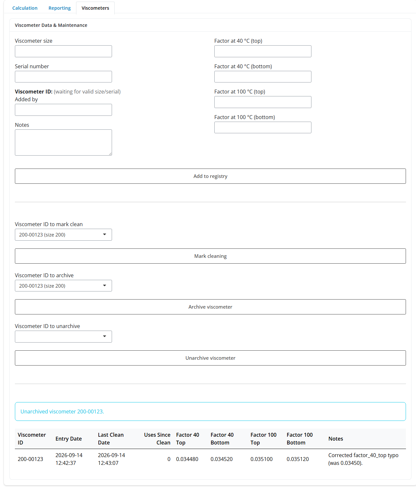

## Appendix: standard reference materials and automated pass/fail

Section [Standard reference-sample QA/QC](#standard-reference-sample-qaqc)
above introduces the **Standard Reference Material** sample type and its
**Expected Value** field. This appendix follows a standard reference
sample all the way through to a locked, reported result, and then shows
what a *failing* check looks like, so the two cases can be compared
directly.

A standard reference material is a substance with a known, certified
kinematic viscosity (an "expected value") used to verify that a
viscometer, operator, and procedure are all performing within the
Characterization Laboratory's QA/QC tolerances -- rather than checking one
sample's internal consistency, it checks the whole measurement process
against a trusted external answer. Because that answer is known in
advance, `kinvicalc` can automatically calculate whether the measured
result agrees with it closely enough, without the operator needing to look
anything up.

### Locking and reporting a passing standard check

Continuing from the passing repeatability/reproducibility check shown
earlier, click **Lock result** just as with any other sample:

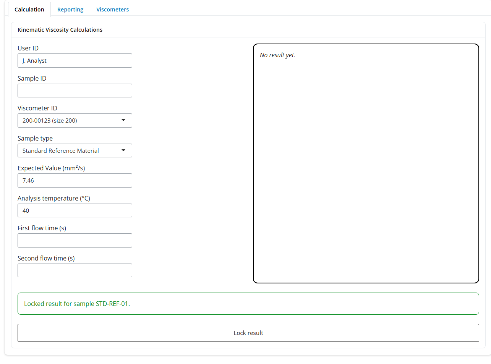

On the **Reporting** tab, the standard reference sample's QA/QC column
shows three pass/fail lines instead of the single determinability line
shown for an ordinary sample, so a reviewer can confirm at a glance that
the viscometer and procedure are in control:

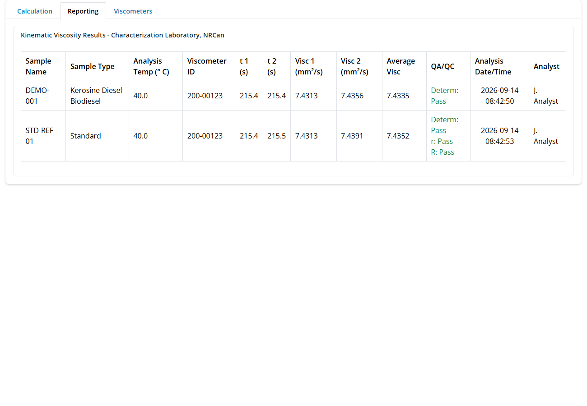

### What a failing standard check looks like

The repeatability and reproducibility limits scale with the expected
value, so entering an expected value that disagrees substantially with the
measured result -- for example, from a mislabeled reference standard, or a
viscometer drifting out of calibration -- produces an automatic **FAIL**
on both checks, shown in red exactly like a failing determinability check:

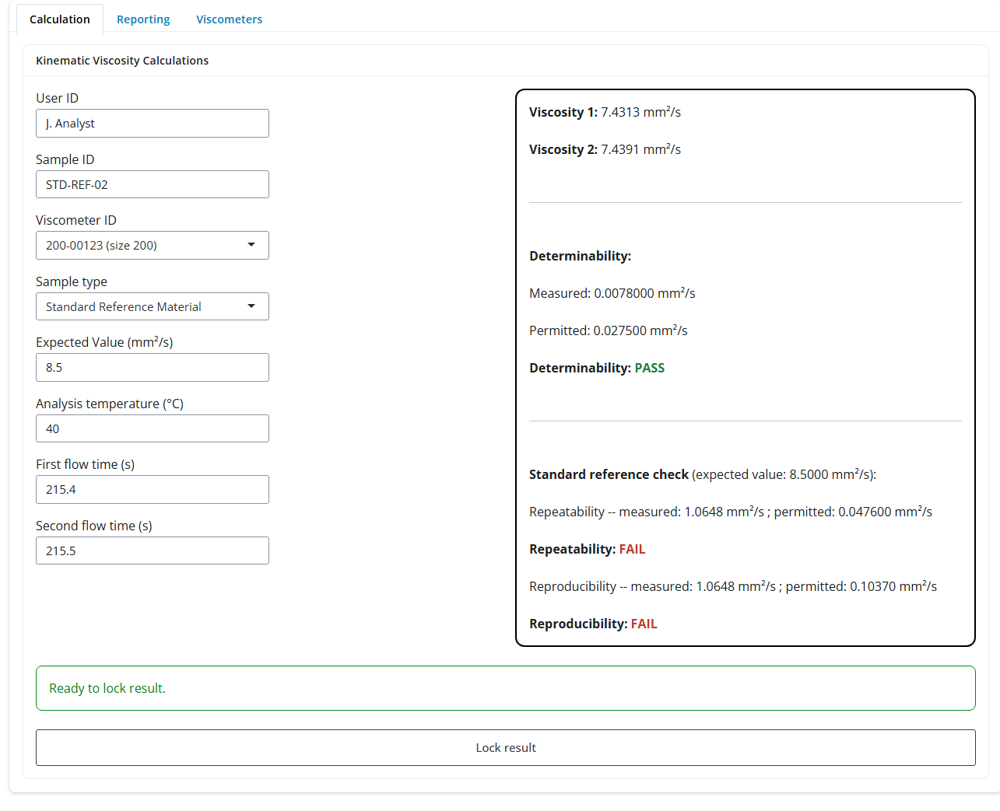

Note that determinability still passed here (the two flow times agree with
each other), since it measures a different thing: determinability compares
the sample's own two determinations to each other, while the repeatability
and reproducibility checks compare the measured result to the known
expected value. A standard reference sample can fail one without the
other, and reviewing all three lines together is what makes the
distinction visible on the **Reporting** tab.
